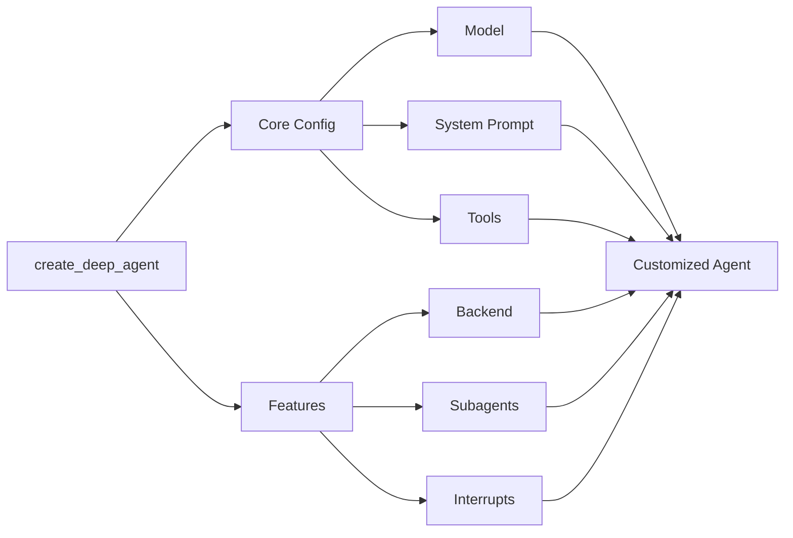

# Customize Deep Agents

> Learn how to customize deep agents with system prompts, tools, subagents, and more



## Model

By default, `deepagents` uses [`claude-sonnet-4-5-20250929`](https://platform.claude.com/docs/en/about-claude/models/overview). You can customize the model used by passing any supported <Tooltip tip="A string that follows the format `provider:model` (e.g. openai:gpt-5)" cta="See mappings" href="https://reference.langchain.com/python/langchain/models/#langchain.chat_models.init_chat_model(model)">model identifier string</Tooltip> or [LangChain model object](/oss/python/integrations/chat).

<CodeGroup>
  ```python Model string theme={null}
  from langchain.chat_models import init_chat_model
  from deepagents import create_deep_agent

  model = init_chat_model(model="gpt-5")
  agent = create_deep_agent(model=model)
  ```

  ```python LangChain model object theme={null}
  from langchain_ollama import ChatOllama
  from langchain.chat_models import init_chat_model
  from deepagents import create_deep_agent

  model = init_chat_model(
      model=ChatOllama(
          model="llama3.1",
          temperature=0,
          # other params...
      )
  )
  agent = create_deep_agent(model=model)
  ```
</CodeGroup>

## System prompt

Deep agents come with a built-in system prompt inspired by Claude Code's system prompt. The default system prompt contains detailed instructions for using the built-in planning tool, file system tools, and subagents.

Each deep agent tailored to a use case should include a custom system prompt specific to that use case.

```python  theme={null}
from deepagents import create_deep_agent

research_instructions = """\
You are an expert researcher. Your job is to conduct \
thorough research, and then write a polished report. \
"""

agent = create_deep_agent(
    system_prompt=research_instructions,
)
```

## Tools

Just like tool-calling agents, a deep agent gets a set of top level tools that it has access to.

```python  theme={null}
import os
from typing import Literal
from tavily import TavilyClient
from deepagents import create_deep_agent

tavily_client = TavilyClient(api_key=os.environ["TAVILY_API_KEY"])

def internet_search(
    query: str,
    max_results: int = 5,
    topic: Literal["general", "news", "finance"] = "general",
    include_raw_content: bool = False,
):
    """Run a web search"""
    return tavily_client.search(
        query,
        max_results=max_results,
        include_raw_content=include_raw_content,
        topic=topic,
    )

agent = create_deep_agent(
    tools=[internet_search]
)
```

In addition to any tools that you provide, deep agents also get access to a number of default tools:

* `write_todos` – Update the agent's to-do list
* `ls` – List all files in the agent's filesystem
* `read_file` – Read a file from the agent's filesystem
* `write_file` – Write a new file in the agent's filesystem
* `edit_file` – Edit an existing file in the agent's filesystem
* `task` – Spawn a subagent to handle a specific task

***

<Callout icon="pen-to-square" iconType="regular">
  [Edit the source of this page on GitHub.](https://github.com/langchain-ai/docs/edit/main/src/oss/deepagents/customization.mdx)
</Callout>

<Tip icon="terminal" iconType="regular">
  [Connect these docs programmatically](/use-these-docs) to Claude, VSCode, and more via MCP for real-time answers.
</Tip>


---

> To find navigation and other pages in this documentation, fetch the llms.txt file at: https://docs.langchain.com/llms.txt