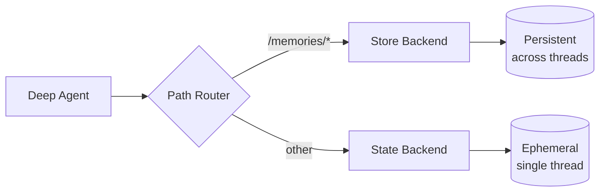

# Long-term memory

> Learn how to extend deep agents with persistent memory across threads

Deep agents come with a local filesystem to offload memory. By default, this filesystem is stored in agent state and is **transient to a single thread**—files are lost when the conversation ends.

You can extend deep agents with **long-term memory** by using a **CompositeBackend** that routes specific paths to persistent storage. This enables hybrid storage where some files persist across threads while others remain ephemeral.



## Setup

Configure long-term memory by using a `CompositeBackend` that routes the `/memories/` path to a `StoreBackend`:

```python  theme={null}
from deepagents import create_deep_agent
from deepagents.backends import CompositeBackend, StateBackend, StoreBackend
from langgraph.store.memory import InMemoryStore

def make_backend(runtime):
    return CompositeBackend(
        default=StateBackend(runtime),  # Ephemeral storage
        routes={
            "/memories/": StoreBackend(runtime)  # Persistent storage
        }
    )

agent = create_deep_agent(
    store=InMemoryStore(),  # Required for StoreBackend
    backend=make_backend
)
```

## How it works

When using `CompositeBackend`, deep agents maintain **two separate filesystems**:

### 1. Short-term (transient) filesystem

* Stored in the agent's state (via `StateBackend`)
* Persists only within a single thread
* Files are lost when the thread ends
* Accessed through standard paths: `/notes.txt`, `/workspace/draft.md`

### 2. Long-term (persistent) filesystem

* Stored in a LangGraph Store (via `StoreBackend`)
* Persists across all threads and conversations
* Survives agent restarts
* Accessed through paths prefixed with `/memories/`: `/memories/preferences.txt`

### Path routing

The `CompositeBackend` routes file operations based on path prefixes:

* Files with paths starting with `/memories/` are stored in the Store (persistent)
* Files without this prefix remain in transient state
* All filesystem tools (`ls`, `read_file`, `write_file`, `edit_file`) work with both

```python  theme={null}
# Transient file (lost after thread ends)
agent.invoke({
    "messages": [{"role": "user", "content": "Write draft to /draft.txt"}]
})

# Persistent file (survives across threads)
agent.invoke({
    "messages": [{"role": "user", "content": "Save final report to /memories/report.txt"}]
})
```

## Cross-thread persistence

Files in `/memories/` can be accessed from any thread:

```python  theme={null}
import uuid

# Thread 1: Write to long-term memory
config1 = {"configurable": {"thread_id": str(uuid.uuid4())}}
agent.invoke({
    "messages": [{"role": "user", "content": "Save my preferences to /memories/preferences.txt"}]
}, config=config1)

# Thread 2: Read from long-term memory (different conversation!)
config2 = {"configurable": {"thread_id": str(uuid.uuid4())}}
agent.invoke({
    "messages": [{"role": "user", "content": "What are my preferences?"}]
}, config=config2)
# Agent can read /memories/preferences.txt from the first thread
```

## Use cases

### User preferences

Store user preferences that persist across sessions:

```python  theme={null}
agent = create_deep_agent(
    store=InMemoryStore(),
    backend=lambda rt: CompositeBackend(
        default=StateBackend(rt),
        routes={"/memories/": StoreBackend(rt)}
    ),
    system_prompt="""When users tell you their preferences, save them to
    /memories/user_preferences.txt so you remember them in future conversations."""
)
```

### Self-improving instructions

An agent can update its own instructions based on feedback:

```python  theme={null}
agent = create_deep_agent(
    store=InMemoryStore(),
    backend=lambda rt: CompositeBackend(
        default=StateBackend(rt),
        routes={"/memories/": StoreBackend(rt)}
    ),
    system_prompt="""You have a file at /memories/instructions.txt with additional
    instructions and preferences.

    Read this file at the start of conversations to understand user preferences.

    When users provide feedback like "please always do X" or "I prefer Y",
    update /memories/instructions.txt using the edit_file tool."""
)
```

Over time, the instructions file accumulates user preferences, helping the agent improve.

### Knowledge base

Build up knowledge over multiple conversations:

```python  theme={null}
# Conversation 1: Learn about a project
agent.invoke({
    "messages": [{"role": "user", "content": "We're building a web app with React. Save project notes."}]
})

# Conversation 2: Use that knowledge
agent.invoke({
    "messages": [{"role": "user", "content": "What framework are we using?"}]
})
# Agent reads /memories/project_notes.txt from previous conversation
```

### Research projects

Maintain research state across sessions:

```python  theme={null}
research_agent = create_deep_agent(
    store=InMemoryStore(),
    backend=lambda rt: CompositeBackend(
        default=StateBackend(rt),
        routes={"/memories/": StoreBackend(rt)}
    ),
    system_prompt="""You are a research assistant.

    Save your research progress to /memories/research/:
    - /memories/research/sources.txt - List of sources found
    - /memories/research/notes.txt - Key findings and notes
    - /memories/research/report.md - Final report draft

    This allows research to continue across multiple sessions."""
)
```

## Store implementations

Any LangGraph `BaseStore` implementation works:

### InMemoryStore (development)

Good for testing and development, but data is lost on restart:

```python  theme={null}
from langgraph.store.memory import InMemoryStore

store = InMemoryStore()
agent = create_deep_agent(
    store=store,
    backend=lambda rt: CompositeBackend(
        default=StateBackend(rt),
        routes={"/memories/": StoreBackend(rt)}
    )
)
```

### PostgresStore (production)

For production, use a persistent store:

```python  theme={null}
from langgraph.store.postgres import PostgresStore
import os

store = PostgresStore(connection_string=os.environ["DATABASE_URL"])
agent = create_deep_agent(
    store=store,
    backend=lambda rt: CompositeBackend(
        default=StateBackend(rt),
        routes={"/memories/": StoreBackend(rt)}
    )
)
```

## Best practices

### Use descriptive paths

Organize persistent files with clear paths:

```
/memories/user_preferences.txt
/memories/research/topic_a/sources.txt
/memories/research/topic_a/notes.txt
/memories/project/requirements.md
```

### Document the memory structure

Tell the agent what's stored where in your system prompt:

```
Your persistent memory structure:
- /memories/preferences.txt: User preferences and settings
- /memories/context/: Long-term context about the user
- /memories/knowledge/: Facts and information learned over time
```

### Prune old data

Implement periodic cleanup of outdated persistent files to keep storage manageable.

### Choose the right storage

* **Development**: Use `InMemoryStore` for quick iteration
* **Production**: Use `PostgresStore` or other persistent stores
* **Multi-tenant**: Consider using assistant\_id-based namespacing in your store

***

<Callout icon="pen-to-square" iconType="regular">
  [Edit the source of this page on GitHub.](https://github.com/langchain-ai/docs/edit/main/src/oss/deepagents/long-term-memory.mdx)
</Callout>

<Tip icon="terminal" iconType="regular">
  [Connect these docs programmatically](/use-these-docs) to Claude, VSCode, and more via MCP for real-time answers.
</Tip>


---

> To find navigation and other pages in this documentation, fetch the llms.txt file at: https://docs.langchain.com/llms.txt