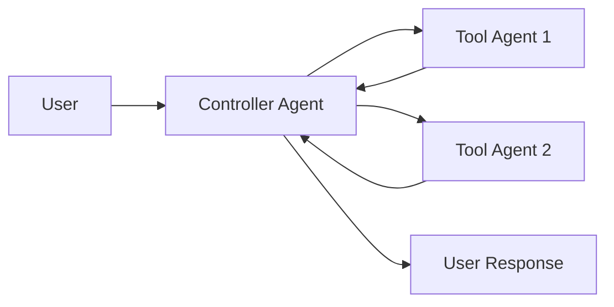
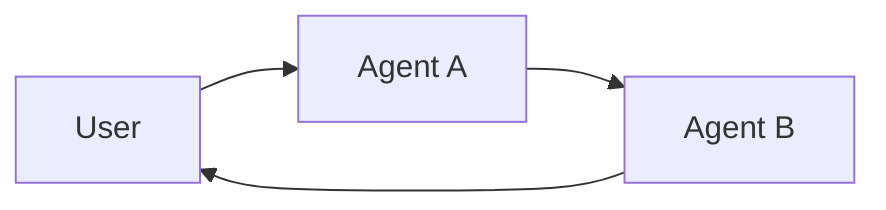

# Multi-agent

**Multi-agent systems** break a complex application into multiple specialized agents that work together to solve problems.
Instead of relying on a single agent to handle every step, **multi-agent architectures** allow you to compose smaller, focused agents into a coordinated workflow.

Multi-agent systems are useful when:

* A single agent has too many tools and makes poor decisions about which to use.
* Context or memory grows too large for one agent to track effectively.
* Tasks require **specialization** (e.g., a planner, researcher, math expert).

## Multi-agent patterns

| Pattern                           | How it works                                                                                                                                                     | Control flow                                               | Example use case                                 |
| --------------------------------- | ---------------------------------------------------------------------------------------------------------------------------------------------------------------- | ---------------------------------------------------------- | ------------------------------------------------ |
| [**Tool Calling**](#tool-calling) | A **supervisor** agent calls other agents as *tools*. The “tool” agents don’t talk to the user directly — they just run their task and return results.           | Centralized: all routing passes through the calling agent. | Task orchestration, structured workflows.        |
| [**Handoffs**](#handoffs)         | The current agent decides to **transfer control** to another agent. The active agent changes, and the user may continue interacting directly with the new agent. | Decentralized: agents can change who is active.            | Multi-domain conversations, specialist takeover. |

<Card title="Tutorial: Build a supervisor agent" icon="sitemap" href="/oss/python/langchain/supervisor" arrow cta="Learn more">
  Learn how to build a personal assistant using the supervisor pattern, where a central supervisor agent coordinates specialized worker agents.
  This tutorial demonstrates:

  * Creating specialized sub-agents for different domains (calendar and email)
  * Wrapping sub-agents as tools for centralized orchestration
  * Adding human-in-the-loop review for sensitive actions
</Card>

## Choosing a pattern

| Question                                              | Tool Calling | Handoffs |
| ----------------------------------------------------- | ------------ | -------- |
| Need centralized control over workflow?               | ✅ Yes        | ❌ No     |
| Want agents to interact directly with the user?       | ❌ No         | ✅ Yes    |
| Complex, human-like conversation between specialists? | ❌ Limited    | ✅ Strong |

<Tip>
  You can mix both patterns — use **handoffs** for agent switching, and have each agent **call subagents as tools** for specialized tasks.
</Tip>

## Customizing agent context

At the heart of multi-agent design is **context engineering** - deciding what information each agent sees. LangChain gives you fine-grained control over:

* Which parts of the conversation or state are passed to each agent.
* Specialized prompts tailored to subagents.
* Inclusion/exclusion of intermediate reasoning.
* Customizing input/output formats per agent.

The quality of your system **heavily depends** on context engineering. The goal is to ensure that each agent has access to the correct data it needs to perform its task, whether it’s acting as a tool or as an active agent.

## Tool calling

In **tool calling**, one agent (the “**controller**”) treats other agents as *tools* to be invoked when needed. The controller manages orchestration, while tool agents perform specific tasks and return results.

Flow:

1. The **controller** receives input and decides which tool (subagent) to call.
2. The **tool agent** runs its task based on the controller’s instructions.
3. The **tool agent** returns results to the controller.
4. The **controller** decides the next step or finishes.



<Tip>
  Agents used as tools are generally **not expected** to continue conversation with the user.
  Their role is to perform a task and return results to the controller agent.
  If you need subagents to be able to converse with the user, use **handoffs** instead.
</Tip>

### Implementation

Below is a minimal example where the main agent is given access to a single subagent via a tool definition:

```python  theme={null}
from langchain.tools import tool
from langchain.agents import create_agent


subagent1 = create_agent(model="...", tools=[...])

@tool(
    "subagent1_name",
    description="subagent1_description"
)
def call_subagent1(query: str):
    result = subagent1.invoke({
        "messages": [{"role": "user", "content": query}]
    })
    return result["messages"][-1].content

agent = create_agent(model="...", tools=[call_subagent1])
```

In this pattern:

1. The main agent invokes `call_subagent1` when it decides the task matches the subagent’s description.
2. The subagent runs independently and returns its result.
3. The main agent receives the result and continues orchestration.

### Where to customize

There are several points where you can control how context is passed between the main agent and its subagents:

1. **Subagent name** (`"subagent1_name"`): This is how the main agent refers to the subagent. Since it influences prompting, choose it carefully.
2. **Subagent description** (`"subagent1_description"`): This is what the main agent “knows” about the subagent. It directly shapes how the main agent decides when to call it.
3. **Input to the subagent**: You can customize this input to better shape how the subagent interprets tasks. In the example above, we pass the agent-generated `query` directly.
4. **Output from the subagent**: This is the **response** passed back to the main agent. You can adjust what is returned to control how the main agent interprets results. In the example above, we return the final message text, but you could return additional state or metadata.

### Control the input to the subagent

There are two main levers to control the input that the main agent passes to a subagent:

* **Modify the prompt** – Adjust the main agent's prompt or the tool metadata (i.e., sub-agent's name and description) to better guide when and how it calls the subagent.
* **Context injection** – Add input that isn’t practical to capture in a static prompt (e.g., full message history, prior results, task metadata) by adjusting the tool call to pull from the agent’s state.

```python  theme={null}
from langchain.agents import AgentState
from langchain.tools import tool, ToolRuntime

class CustomState(AgentState):
    example_state_key: str

@tool(
    "subagent1_name",
    description="subagent1_description"
)
def call_subagent1(query: str, runtime: ToolRuntime[None, CustomState]):
    # Apply any logic needed to transform the messages into a suitable input
    subagent_input = some_logic(query, runtime.state["messages"])
    result = subagent1.invoke({
        "messages": subagent_input,
        # You could also pass other state keys here as needed.
        # Make sure to define these in both the main and subagent's
        # state schemas.
        "example_state_key": runtime.state["example_state_key"]
    })
    return result["messages"][-1].content
```

### Control the output from the subagent

Two common strategies for shaping what the main agent receives back from a subagent:

* **Modify the prompt** – Refine the subagent’s prompt to specify exactly what should be returned.
  * Useful when outputs are incomplete, too verbose, or missing key details.
  * A common failure mode is that the subagent performs tool calls or reasoning but does **not include the results** in its final message. Remind it that the controller (and user) only see the final output, so all relevant info must be included there.
* **Custom output formatting** – adjust or enrich the subagent's response in code before handing it back to the main agent.
  * Example: pass specific state keys back to the main agent in addition to the final text.
  * This requires wrapping the result in a [`Command`](https://reference.langchain.com/python/langgraph/types/#langgraph.types.Command) (or equivalent structure) so you can merge custom state with the subagent’s response.

```python  theme={null}
from typing import Annotated
from langchain.agents import AgentState
from langchain.tools import InjectedToolCallId
from langgraph.types import Command


@tool(
    "subagent1_name",
    description="subagent1_description"
)
# We need to pass the `tool_call_id` to the sub agent so it can use it to respond with the tool call result
def call_subagent1(
    query: str,
    tool_call_id: Annotated[str, InjectedToolCallId],
# You need to return a `Command` object to include more than just a final tool call
) -> Command:
    result = subagent1.invoke({
        "messages": [{"role": "user", "content": query}]
    })
    return Command(update={
        # This is the example state key we are passing back
        "example_state_key": result["example_state_key"],
        "messages": [
            ToolMessage(
                content=result["messages"][-1].content,
                # We need to include the tool call id so it matches up with the right tool call
                tool_call_id=tool_call_id
            )
        ]
    })
```

## Handoffs

In **handoffs**, agents can directly pass control to each other. The “active” agent changes, and the user interacts with whichever agent currently has control.

Flow:

1. The **current agent** decides it needs help from another agent.
2. It passes control (and state) to the **next agent**.
3. The **new agent** interacts directly with the user until it decides to hand off again or finish.



### Implementation (Coming soon)

***

<Callout icon="pen-to-square" iconType="regular">
  [Edit the source of this page on GitHub.](https://github.com/langchain-ai/docs/edit/main/src/oss/langchain/multi-agent.mdx)
</Callout>

<Tip icon="terminal" iconType="regular">
  [Connect these docs programmatically](/use-these-docs) to Claude, VSCode, and more via MCP for real-time answers.
</Tip>


---

> To find navigation and other pages in this documentation, fetch the llms.txt file at: https://docs.langchain.com/llms.txt