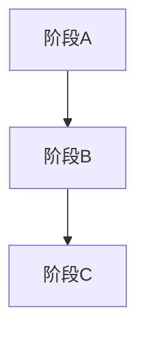

# 概览与目标
- 愿景/业务价值（≤2 行）：为什么做、解决什么问题、预期收益。
- 范围与边界：做什么 / 不做什么（简要列点）。

# 术语与角色
- 术语表（可选）：列关键术语及定义。
- 角色表（建议表格）：角色 | 接入/注册方式 | 关键权限/责任。

# 业务流程 / 用户旅程
- 分阶段描述（如 A→B→C…），每段含：主要角色、核心动作、输入/输出、完成信号、关键风险。
- 可视化（推荐 mermaid 高层导航图，不含实现）：

# 界面 / 信息架构骨架（可选，技术无关）
- 表格：页面/区域 | 关键模块 | 主要操作/输入输出 | 完成信号 | 观测点。
- 仅列骨架与关键交互，不写组件或技术实现。

# 关键业务场景
- 每场景包含：前置条件/触发、主路径步骤（3–7 步）、期望结果、1–2 条异常/分支、观测点或可验证信号。
- 场景编号对应流程阶段（如 A→C、C→E）。

# 功能需求（按流程阶段分组）
- 结构：\[阶段\] 功能点：描述；验收信号（可观测事件）；边界/限制（可选）。
- 保持技术无关、可验证。

# 非功能需求（分层+量化）
- 性能、可用性、扩展性、安全/隐私、可观测性、体验。
- 每类 1–2 条可量化指标，最好绑定流程节点（如“差异生成 P95 ≤10s（D→E）”）。
- 降级/回退策略要点。

# 约束与假设
- 关键假设与可能受影响的功能/非功项。
- 外部/内部依赖（如 SSO、模型、VCS、日志管道）。

# 成功标准
- 可度量、技术无关；可含端到端漏斗或阶段转化指标。
- 示例：转化率、时间阈值、满意度、错误率等。

# 风险与缓解
- 列风险、触发条件、影响、缓解或监控点；优先跨阶段或跨系统风险。

# 边界情形
- 史诗级异常或回滚场景（如大文件、冲突、长时任务、凭证失效、多人并发等），给出期望处理策略。

# 澄清事项（≤3）
- 使用 `[NEEDS CLARIFICATION: ...]`，引用所在章节或场景，并给出默认选项 A/B（含影响）；超限则收敛为假设。

