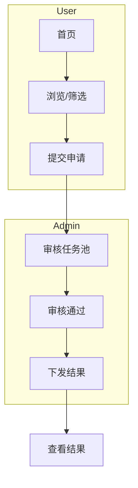

# {EPIC TITLE} - 高层业务文档（High-Level）

> 目标：用 2-3 页呈现业务逻辑与范围；主路径可视化（含 Mermaid）；便于拆分 speckit.specify 子任务。

## 1) 摘要与成功标准
- 业务目标：
- 关键 KPI / 成功度量：
- 范围与上线时间：

## 2) 业务蓝图
- 核心用户旅程/场景（3-7）：{按角色/场景，3-5 句/项}
- 业务事件流（主干时序/状态转换）：
- 业务对象表（对象 | 核心属性 | 状态 | 备注）：

## 3) 核心流程（含 Mermaid）
- 角色分块的自然语言流程（管理员 / 普通用户 / 其他）：
  - 管理员主流程：
  - 普通用户主流程：
  - 其他角色（可选）：
- Mermaid 流程图（graph TD；7-12 节点；可用 subgraph 区分角色）：

## 4) 能力分解与边界
- 一级能力（3-7）：{目的 | 输入 | 输出 | 触发}
- Out-of-scope：{明确不做的事项}

## 5) 非功能关键点（与业务紧耦合）
- 合规 / 性能 / 可观测性 / 容错：{仅列必要要点}

## 6) speckit.specify 子任务清单
| 任务 | 目标 | 输入上下文（引用本文件段落编号） | 输出物 | 验收标准 | 依赖 | 复杂度(0.5-2d) | 并行组 |
| --- | --- | --- | --- | --- | --- | --- | --- |
|  |  |  |  |  |  |  |  |

> 长度控制：全稿 2-3 页；每节 3-7 项；句子尽量短。

