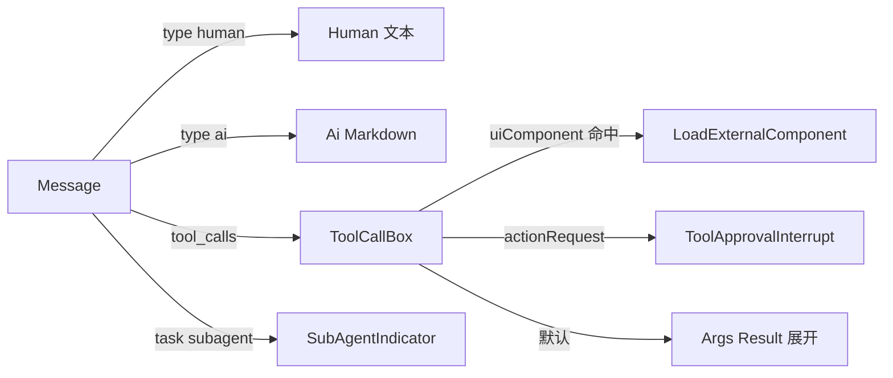
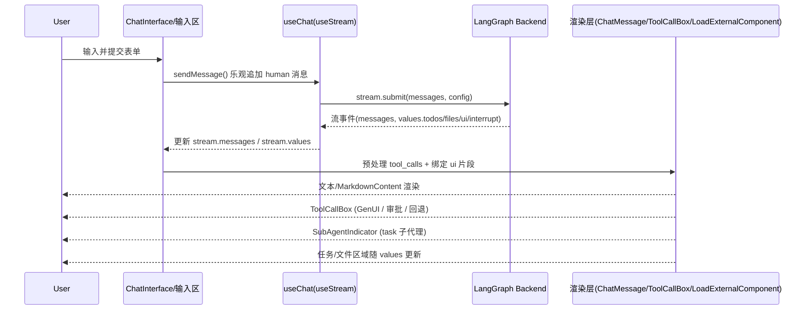

# 组件架构设计文档（deep-agents-ui）

## 1. 背景与范围

- 目标：梳理除基础 UI 外的业务/页面组件结构、层级与数据/渲染链路，便于扩展与维护。
- 范围：对话页、线程列表、配置弹窗、工具调用与生成式 UI、任务/文件侧栏、审批交互、Markdown 渲染。

## 2. 组件树（页面层级与动态分支）

页面组件树（等宽体，分层 + 条件标注）：

```
App Shell / Page
└─ ChatProvider 〔提供 useChat 状态〕
   └─ ChatInterface （主容器）
      ├─ 消息区（遍历 processedMessages）
      │  └─ ChatMessage 〔按 message.type / tool_calls 动态〕
      │     ├─ Human 文本块                  [条件: type == 'human']
      │     ├─ MarkdownContent               [条件: type == 'ai']
      │     ├─ ToolCallBox                   [条件: 存在 tool_calls]
      │     │  ├─ LoadExternalComponent      [条件: uiComponent 命中]
      │     │  ├─ ToolApprovalInterrupt      [条件: actionRequest / reviewConfig]
      │     │  └─ 参数/结果回退展示          [条件: 其他]
      │     └─ SubAgentIndicator + MarkdownContent
      │        [条件: tool.name == 'task' 且 subagent_type 存在]
      ├─ Meta 区（任务/文件）
      │  └─ 内联任务/文件块（当前未抽组件）
      └─ 输入区（内联 form/textarea/button）

└─ ThreadList      [条件: 线程侧栏显示时挂载]
└─ ConfigDialog    [条件: 配置弹窗打开时挂载]
```

## 3. 消息与工具渲染分支

- 文本：human → 内联文本；ai → `MarkdownContent`。
- 工具调用：`GenUI`（`uiComponent` 命中） > `审批`（`actionRequest`/`reviewConfig`） > `回退展示`（args/result）；状态图标区分 pending/completed/error/interrupted。
- 子代理：tool 名为 `task` 且含 `subagent_type` → `SubAgentIndicator` + MarkdownContent。
- 输入/控制：`isLoading` 控制发送/停止；`interrupt` 控制审批与继续。

渲染分支图：



## 4. 组件职责要点（精简）

- ChatProvider / useChat：封装 `useStream`，暴露 `stream`、`messages`、`values`、控制方法。
- ChatInterface：聚合状态、预处理 tool_calls，渲染消息区 + 任务/文件 + 输入。
- ChatMessage：按消息类型分流，桥接工具调用与子代理展示。
- ToolCallBox：三态优先级（GenUI / 审批 / 回退），向 GenUI 透传 meta。
- LoadExternalComponent：按 `name` + `namespace` 动态加载或本地覆盖生成式 UI。
- ToolApprovalInterrupt：审批与可选参数编辑。
- ThreadList：线程筛选与选择。
- ConfigDialog：部署/assistant 配置输入。
- MarkdownContent：Markdown + 代码高亮。

## 5. 消息发送到渲染完成的时序



## 6. 架构原则与约束（高层）

- 模块边界：状态层（useChat/useStream）与展示层（ChatInterface/ChatMessage/ToolCallBox 等）分离；生成式 UI 通过 LoadExternalComponent 解耦。
- 扩展点：ToolCallBox 的 GenUI 覆盖（components）、审批策略扩展、任务/文件区可抽象为独立组件、输入区可抽象为 ChatInput。
- 约束：LoadExternalComponent 不支持嵌套；`message.name`/`tool_call_id`/`metadata.tool_call_id` 必须与后端一致；当前任务/文件与输入区为内联实现，抽象需同步更新文档。
- 默认 namespace：LoadExternalComponent 默认使用 assistantId/graphId。
- 状态通路（简述）：useStream → useChat（暴露 stream.messages/values） → ChatInterface 预处理 → ChatMessage/ToolCallBox/子组件按需绑定。
- 可选 NFR：如需团队统一，可在此补充性能/可达性/主题化约束（当前未特定约束）。

## 7. 关键文件索引（便于查阅）

- `src/app/hooks/useChat.ts`：流与状态封装
- `src/providers/ChatProvider.tsx`：上下文提供
- `src/app/components/ChatInterface.tsx`：容器与消息预处理
- `src/app/components/ChatMessage.tsx`：消息分流、子代理入口
- `src/app/components/ToolCallBox.tsx`：工具调用三态渲染
- `src/app/components/ToolApprovalInterrupt.tsx`：审批交互
- `src/app/components/SubAgentIndicator.tsx`：子代理卡片
- `src/app/components/TasksFilesSidebar.tsx`：任务/文件侧栏（当前内联逻辑可替换）
- `src/app/components/ThreadList.tsx`：线程列表
- `src/app/components/ConfigDialog.tsx`：配置弹窗
- `src/app/components/MarkdownContent.tsx`：Markdown 渲染
