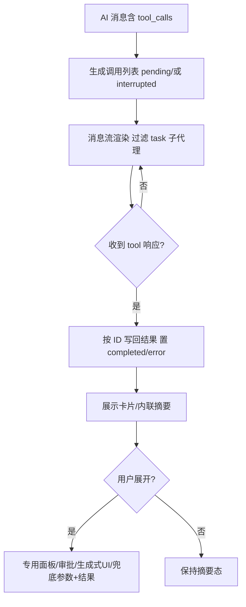

# 13 工具调用与界面展示（原型稿概述）
- 状态：草稿
- 对应需求：`docs/requirements/13-tool-calls-and-display.md`
- 目标：展示工具调用的生命周期、展示策略（卡片/内联）、专用面板差异化、折叠/滚动行为与异常态。

## 页面/区域结构（建议）
- 消息流区域：每条消息内按顺序挂载工具展示（卡片或内联摘要）；task 子代理以独立子代理卡展示。
- 工具卡片/内联摘要：
  - 顶部：状态条（pending 动效；interrupted 橙；error 红；可选 completed 绿/默认）、工具名/摘要。
  - 摘要行：短摘要 + 状态文案（调用完成/调用中/调用失败/调用中断）。
  - 主体：可折叠/展开，默认限高+滚动；无内容且无 UI/审批时展开按钮禁用。
- 抽屉优先级：1) 生成式 UI 面板 2) 审批中断面板 3) 专用工具面板 4) 兜底参数折叠 + 结果文本/JSON。

## 按类型的原型要点
- 搜索类（internet_search）
  - 容器无外边框；内部按来源顺序的二级折叠项，显示网站 Logo + 标题；点击展开后显示摘要列表，列表项可复制链接或跳转（若允许）。
  - 默认限高+滚动。
- 文件读/写/编辑（read_file / write_file / edit_file）
  - 摘要含路径+操作类型；展开显示片段/变更预览，可复制；限高滚动。
- 目录（ls）
  - 摘要含路径+条目数；展开为可滚动列表/分组（类型/大小/时间）。
- 待办（write_todos / todo）
  - 摘要含完成数/总数；展开列出待办项，支持复制；限高滚动。
- 兜底类（其他工具）
  - 摘要为“工具调用”或短摘要；展开为参数折叠 + 结果文本/JSON，限高滚动。

## 交互流程（概要）
1) AI 消息生成 tool_calls → 建立调用项（pending/若中断则 interrupted）。
2) 后续 tool 消息按 ID 写回结果 → 状态 completed/或 error。
3) 渲染时过滤 task 子代理，其他按顺序展示卡片/内联摘要。
4) 用户可展开查看：按优先级选择专用面板/审批/生成式 UI/兜底参数+结果；折叠不影响状态。
5) 错误/中断在摘要与内容区同时提示；可选提供重试入口（业务自定）。

## 异常与边界
- 中断：该轮调用初始 interrupted，不再自动置 completed。
- 配对缺失：无匹配 ID 的 tool 消息被忽略并记录。
- 解析失败：参数/结果 JSON 解析失败回退纯文本。
- 超时/失败：状态 error，摘要与详情提示原因；重试入口按业务决定。

## 资产与联动
- 图标：工具类型图标、状态徽标；搜索来源 Logo。
- 颜色：状态条颜色（pending 动效、interrupted 橙、error 红、completed 可选绿）。

## 待确认
- 折叠限高的具体像素/行数；移动端/小屏适配策略。
- 二级折叠的最大展示项数、默认展开策略。
- 结果列表中外链跳转策略（新窗口/同窗口、是否提示）。

