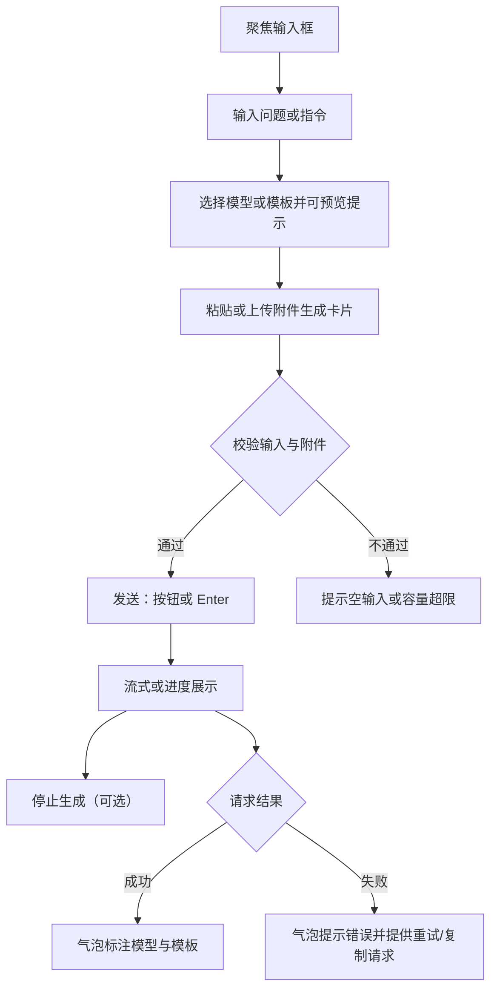

# 对话输入与发送 - 需求说明

## 目标与范围
- 目标：支持高效输入、模型/提示词选择、附件上下文、发送/停止、错误重试。
- 范围：输入框、快捷键、模型/模板选择、附件处理、发送流程、错误反馈。

## 用户故事
- 作为用户，我能快速输入并选择模型/提示词，粘贴日志或截图作为上下文。
- 作为用户，发送后可中断生成，失败时能重试或复制请求。

## 主流程（普通用户）
1) 聚焦输入框（可用 Ctrl/Cmd+K），输入问题或指令，可选模型与提示词模板；需要时展开预览合成的最终提示。
2) 粘贴或拖入文本/图片/日志生成附件卡片，等待上传完成；空输入或附件异常时给出轻提示并阻止发送。
3) 点击“发送”或按 Enter；按钮进入 Loading，消息区开始流式返回或显示步骤进度。
4) 发送中按钮切换为“停止生成”，可点击终止；终止后保留已生成内容并标记“已中断”。
5) 请求成功：消息气泡标注使用的模型与模板。请求失败或超时：气泡内展示错误原因/追踪 ID，并提供“重试”“复制请求”（401/超时附“去设置”入口）。

## 关键交互
- 快捷键：Enter 发送，Shift+Enter 换行，Ctrl/Cmd+K 聚焦输入。
- 输入框下拉选择模型与模板，当前选择在消息气泡标注。
- 附件卡片可移除；支持文本/图片（截图）/日志片段。
- 发送前提示词可展开预览（展示合成后的最终提示）。

## 界面组件与元素明细
- 输入区域：默认单行、按内容自动增高，Placeholder“输入问题，Shift+Enter 换行”；空输入禁用发送；粘贴文本/截图/日志自动生成附件卡片；聚焦可用 Ctrl/Cmd+K。
- 模型选择：输入框旁下拉，展示模型名称、默认标记；支持搜索/切换；获取失败时提示“模型列表获取失败，点击重试”；发送后在消息气泡标注所用模型。
- 提示词模板选择：与模型选择并列；显示模板名称与摘要；选中后可点击“查看最终提示”展开合成预览（含变量替换）；未选时展示“无模板”。
- 附件卡片区：输入框下方排列卡片，含类型图标、名称/摘要、大小/状态；上传中显示进度与取消；失败提示原因并可重试；单卡可删除；支持文本/图片（截图）/日志。
- 发送/停止按钮：主按钮“发送”，附快捷键提示“Enter”；状态：默认（可点击）、禁用（空输入或附件上传中）、Loading（请求中显示旋转/进度）；请求中按钮文案改为“停止生成”，点击发出终止信号。
- 进度与流式展示：发送后在按钮或消息气泡中显示流式 token 或步骤进度；终止后标记“已中断”并保留已生成内容。
- 错误反馈：消息气泡内展示错误类型、原因与可选追踪 ID；提供“重试”“复制请求”操作，超时或 401 附“去设置”入口（模型配置）。
- 容量与校验提示：空输入点击发送时轻提示；单附件 < 5MB，总计 < 20MB（可配置），超限时在卡片处提示并阻止发送。
- 气泡标注：已发送消息在气泡头部标注使用的模型与模板名称，便于回溯。

## 边界与异常
- 空输入禁止发送，给出轻提示。
- 附件上传/解析失败，提示原因并允许重试或删除附件。
- 发送超时提示并可重试；停止后保留已生成内容并标记为“已中断”。

## 非功能
- 输入响应无明显延迟；发送请求可配置超时，默认 < 10s（不含工具）。
- 附件上传单个 < 5MB，整体 < 20MB（可配置）。

## 依赖
- 模型/提示词配置服务；附件上传或本地解析服务；对话编排 API。

## 验收标准
- 输入、模型/模板选择与附件添加可用；快捷键工作正常。
- 发送后可看到流式/进度，停止按钮生效；失败时可重试或复制请求。
- 消息气泡准确标注使用的模型与模板；中断状态标识清晰。

