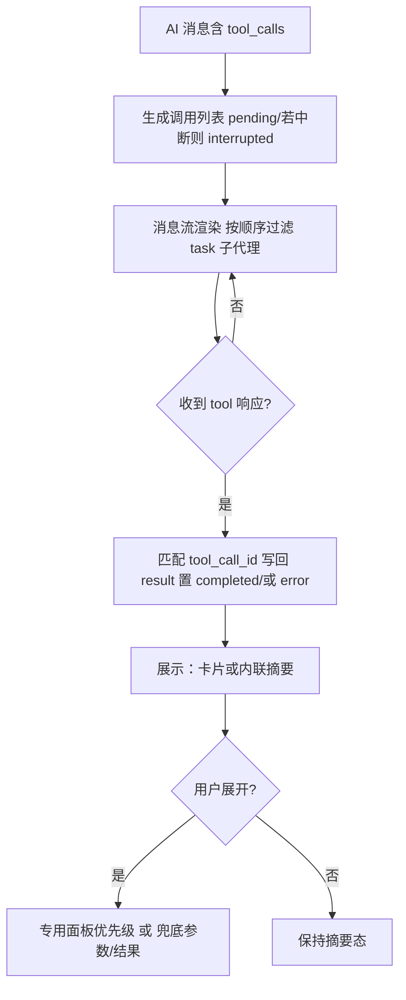

# 工具调用与界面展示 - 需求说明

## 目标与范围
- 目标：在对话中完整呈现工具调用的生命周期（解析、状态、结果、摘要、展开细节），支持专用面板与兜底展示。
- 范围：调用列表生成与更新、状态与摘要、卡片/内联展示策略、专用面板优先级、错误/中断处理、与消息流的挂载关系。

## 用户故事
- 作为用户，我能在消息中看到每一次工具调用的状态、摘要与结果，并可展开查看参数与详细结果。
- 作为用户，我能区分不同工具的专用展示（搜索、读写文件、目录、待办等），并在失败或中断时得到明确提示与重试线索。
- 作为用户，当工具需要审批或生成式 UI 时，我能在同一位置看到对应的嵌入式面板或审批卡片。

## 主流程（工具调用生命周期）
1) AI 消息产生 tool_calls，前端初始化调用列表：默认 pending，若该轮被中断则置 interrupted；human 消息初始化空列表。
2) 后续 tool 类型消息按 tool_call_id 写回对应调用的 result，并将状态置为 completed；若失败则置 error。
3) 消息渲染：过滤 name 为 task 且带 subagent_type 的调用（交由子代理卡片），其余按消息内顺序渲染。
4) 可视化工具使用卡片展示状态条、图标与摘要；点击可展开抽屉，按优先级选择专用面板或兜底参数+结果视图。纯文本工具可直接内联展示摘要/结果。
5) 用户可查看、展开或忽略调用；错误或中断时展示原因与状态，必要时提供重试入口（由业务决定）。

## 关键交互与组件
- 调用数据生成：AI 消息的 tool_calls 解析为 {id,name,args,status}；中断时初始状态为 interrupted；tool 类型消息匹配同 ID 写回 result 并置为 completed。
- 展示挂载：按消息内顺序渲染；name 为 task 且含 subagent_type 的调用用子代理卡片，其余根据展示策略进入卡片或内联。
- 卡片交互（适用于需要可视化的工具）：状态条（pending 动效、interrupted 橙、error 红、可选 completed 绿/默认色），摘要行，展开抽屉；无内容且无 UI/审批时按钮禁用。
- 展示策略分级：
  - 可视化卡片：搜索、读写/编辑文件、目录、待办等需要可操作或可视化反馈的工具。
  - 轻量文本：低风险或纯文本结果的工具直接内联展示摘要/结果，不强制卡片。
  - 子代理：name 为 task 且含 subagent_type 的调用不进入工具卡片，使用子代理卡。
- 抽屉优先级：1) 生成式 UI 面板（需外部 UI 组件标识与流式上下文）；2) 审批中断面板（需审批请求与恢复回调）；3) 专用工具面板；4) 兜底参数折叠 + 结果文本/JSON（尝试 JSON 解析）。

## 工具交互与生命周期（按类型细化）
- 通用生命周期阶段（适用于所有工具）：创建 → 等待结果 → 完成/失败/中断 → 折叠/展开。状态文案：“调用完成/调用中/调用失败/调用中断”。

### 1. 搜索类（internet_search）
- 摘要：查询词 + 结果数量/来源概览。
- 展开：无外边框的折叠容器；内部按搜索来源顺序生成二级折叠，每个来源项展示网站 Logo 与标题，点击展开显示该来源的摘要列表；摘要项可复制链接或跳转（若允许）。
- 状态：完成更新结果数；失败标红给出原因。
- 交互：摘要点击展开/折叠；列表项可跳转/复制；无编辑。
- 折叠面板：默认限高并出现滚动条，列表过长不撑满视口。

### 2. 文件读/写/编辑类（read_file / write_file / edit_file）
- 摘要：路径 + 操作类型；写/编辑显示变更行数或字符数，读显示片段长度。
- 展开：读显示片段/全文（超长折叠，支持复制）；写/编辑显示目标路径、变更摘要与预览，可复制变更文本。
- 状态：完成标记已完成；失败给出权限/路径/校验原因；中断保留已收集内容提示。
- 交互：展开/折叠；复制片段或变更；无修改入口。
- 折叠面板：默认限高可滚动，长文本/代码片段不撑满视口。

### 3. 目录类（ls）
- 摘要：目标路径 + 条目数。
- 展开：列表/分组展示子项（类型、大小、修改时间如可用）。
- 状态：完成更新条目数；失败提示路径/权限原因。
- 交互：展开查看列表；可复制路径；无导航跳转。
- 折叠面板：默认限高可滚动，长列表保留滚动条。

### 4. 待办类（write_todos / todo）
- 摘要：完成数/总数，突出待办标题或首条。
- 展开：列出待办项（标题、状态、可选描述），可显示新增/更新。
- 状态：完成后更新计数；失败提示格式/写入原因。
- 交互：展开/折叠；可复制待办列表；无直接编辑。
- 折叠面板：默认限高可滚动，长列表不撑满视口。

### 5. 兜底类（其他工具）
- 摘要：通用文案“工具调用”或基于参数/结果提取的短摘要。
- 展开：参数折叠列表 + 结果文本/JSON（解析失败回退纯文本）。
- 状态：按通用阶段；错误/中断在摘要与展开区域同时提示。
- 交互：展开/折叠；可复制文本（若提供复制）。
- 折叠面板：默认限高并出现滚动条，防止长文本/列表撑满视口；保持摘要区域始终可见。

## 边界与异常
- 中断：当轮被用户停止时，该轮调用初始状态为 interrupted，后续不自动置 completed。
- 配对缺失：收到 tool 消息找不到 ID，记录日志并忽略（不新增空卡）。
- 解析失败：参数/结果 JSON 解析失败回退纯文本。
- 超时/失败：状态置 error，摘要与详情展示原因；可选提供重试入口（业务自定）。

## 非功能
- 性能：状态更新与渲染不阻塞消息流；抽屉内容按需加载（如生成式 UI）。
- 可靠性：ID 匹配幂等；异常不影响其他调用展示。
