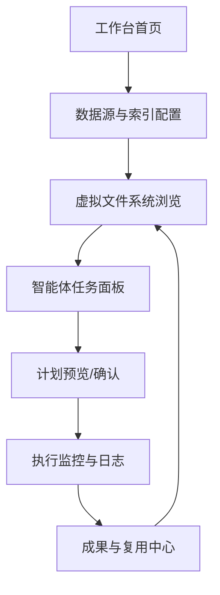

# 1. 业务概述

- 面向内部产品、研发与运维团队的 Web 界面 AI 深度智能体，统一封装虚拟文件系统访问与本地知识检索，缩短从需求到行动的上下文准备时间。
- 目标用户：需要快速理解并操作本地文档/代码的团队成员；主要价值：降低搜索与整理成本、提供可审计的自动化行动与结果复用。

# 2. 核心功能

## 2.1 用户角色（可选）

| 角色                     | 注册/获取方式      | 核心权限                                                    |
| ------------------------ | ------------------ | ----------------------------------------------------------- |
| 使用者（产品/研发/运维） | 受邀或组织账号登录 | 查看授权空间、浏览虚拟文件系统、提交/复用任务、查看执行记录 |
| 空间管理员               | 组织管理员指派     | 配置数据源与访问范围、管理权限、审批高风险执行              |

## 2.2 功能模块（Sitemap 雏形）

1. **工作台首页**：查看活跃空间、最近任务、快速进入文档与智能体入口。
2. **数据源与索引配置**：连接本地/网盘/仓库，设置索引范围、刷新与屏蔽规则。
3. **虚拟文件系统浏览**：以统一树/路径视图展示已授权资源，含元信息与安全提示。
4. **智能体任务面板**：填写需求、选择输入范围，预览智能体计划与预计产出。
5. **执行监控与日志**：查看分步执行进度、日志、人工中断/回退与重试入口。
6. **成果与复用中心**：查看输出、下载/分享、保存为模板或可复用任务卡片。

# 3. 核心流程

## 3.1 流程描述

- 用户进入工作台首页，选择或创建空间并确认已授权的数据源与访问范围。
- 在数据源与索引配置中设定同步范围、刷新频率与屏蔽规则，系统生成虚拟文件系统视图。
- 用户在虚拟文件系统中选定上下文，进入智能体任务面板编写需求并预览计划。
- 用户确认计划后触发执行，执行监控与日志页面展示每一步的上下文、动作与结果，可随时中止或回退。
- 执行完成后，成果与复用中心汇总输出与可复用的任务模板，支持再次调用或分享给团队。

## 3.2 流程可视化

# 4. 非功能需求与约束

- 性能：常用页面加载与导航 ≤ 2s；索引/同步进度可视化，增量刷新延迟可监测。
- 安全与权限：最小权限访问、隔离不同空间的数据源；关键操作与执行步骤全量审计。
- 可控性：执行需可暂停/中断/回退，关键步骤需二次确认或审批；结果可追溯到所用上下文。
- 可用性与可理解性：智能体计划与执行日志需可读、可导出，支持复用模板降低学习成本。

# 5. 待澄清事项

- [NEEDS CLARIFICATION: 知识范围与源类型] 选项 A：仅本地文件/网盘（默认）；选项 B：包含代码仓与数据库。影响：数据连接方式与权限模型复杂度、索引格式。
- [NEEDS CLARIFICATION: 执行权限边界] 选项 A：仅读取与生成建议（默认）；选项 B：允许直接写回或批量修改。影响：审计与审批机制、回退设计、用户责任界定。

